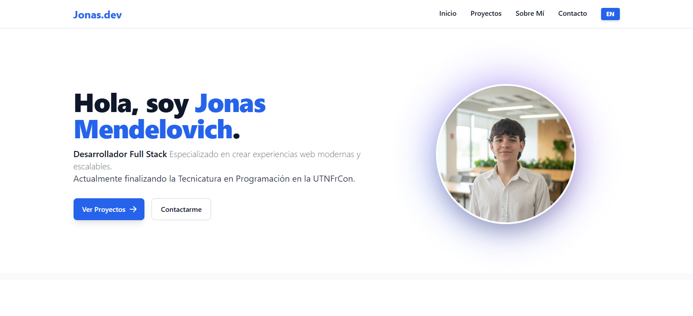
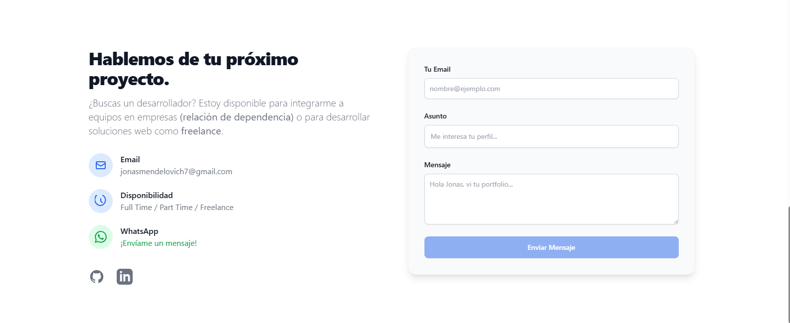

<div align="center">

  # 👨‍💻 Portfolio Personal | Jonas
  
  ### Desarrollador Full Stack & Estudiante UTN
  
  
  
  
  

  <br />

  <a href="portfolio-jonas-gilt.vercel.app">
    
  </a>

</div>

<br />

## 📄 Sobre el Proyecto

Este es mi portfolio personal diseñado para mostrar mis proyectos, habilidades y experiencia como Desarrollador Full Stack. 

El objetivo principal fue crear una **Single Page Application (SPA)** moderna, rápida y totalmente responsive, utilizando las últimas características de **Angular 17+ (Standalone Components)** y **Tailwind CSS** para un diseño limpio y profesional.

El sitio actúa como punto de contacto para oportunidades laborales en relación de dependencia o servicios freelance a través de mi marca **Digital Solutions**.

---

## 📸 Capturas de Pantalla

| **Home / Hero Section** | **Formulario de Contacto** |
|:-----------------------:|:--------------------------:|
|  |  |

*(Nota: Asegúrate de subir tus capturas a una carpeta o actualiza estas rutas)*

---

## 🚀 Tecnologías y Herramientas

* **Framework:** Angular (Standalone Components, sin módulos).
* **Lenguaje:** TypeScript.
* **Estilos:** Tailwind CSS (Diseño Utility-first).
* **Formularios:** Angular Reactive Forms + Validaciones.
* **Email Service:** EmailJS (Envío de correos directo desde el frontend).
* **Hosting/Deploy:** Vercel + Git integration.
* **Control de Versiones:** Git & GitHub.

---

## ✨ Características Principales

* ✅ **Diseño Responsivo:** Adaptable perfectamente a móviles, tablets y escritorio.
* ✅ **Modo Oscuro/Claro:** Preparado para futuras implementaciones de temas.
* ✅ **Formulario Funcional:** Integración con EmailJS para recibir propuestas directamente al correo.
* ✅ **Botón de WhatsApp:** Enlace directo a chat para consultas rápidas.
* ✅ **Arquitectura Limpia:** Estructura de componentes reutilizables y escalables.

---

## 🛠️ Instalación y Ejecución Local

Si quieres clonar y correr este proyecto en tu máquina:

1.  **Clonar el repositorio:**
    ```bash
    git clone [https://github.com/jonimende/Portfolio-Jonas.git](https://github.com/jonimende/Portfolio-Jonas.git)
    ```

2.  **Instalar dependencias:**
    ```bash
    cd Portfolio-Jonas
    npm install
    ```

3.  **Ejecutar servidor de desarrollo:**
    ```bash
    ng serve
    ```

4.  **Abrir en el navegador:**
    Navega a `http://localhost:4200/`.

---

## 📬 Contacto

Estoy abierto a nuevas oportunidades laborales y proyectos freelance.

* **Email:** [jonasmendelovich7@gmail.com](mailto:jonasmendelovich7@gmail.com)
* **LinkedIn:** [Mi Perfil](https://www.linkedin.com/in/jon%C3%A1s-mendelovich-39273030b/)
* **GitHub:** [@jonimende](https://github.com/jonimende)

---

<div align="center">
  <sub>Desarrollado con ❤️ por Jonas | 2026</sub>
</div>
